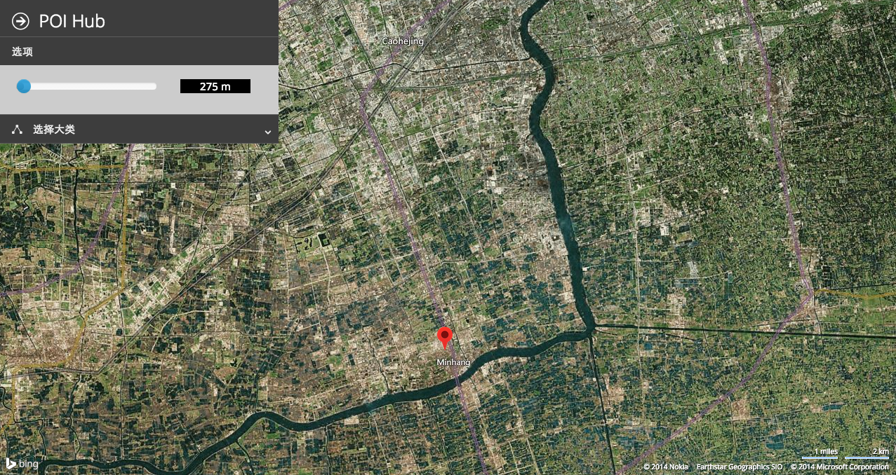
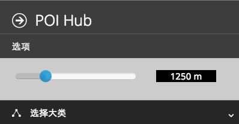
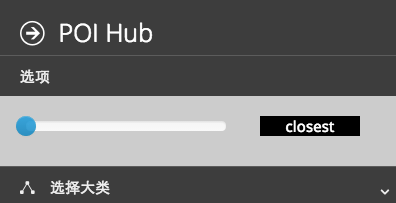
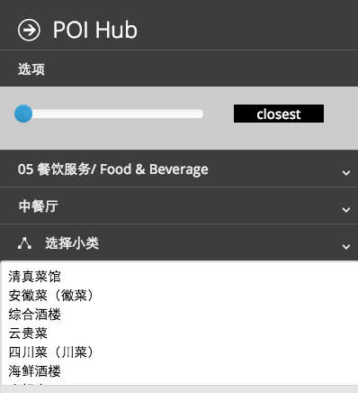
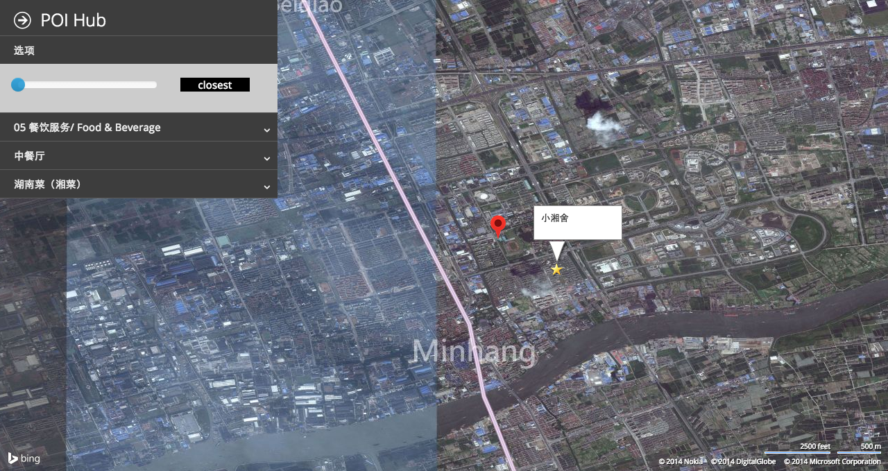

What is POI Query?
=================

This demo system provides queries of Point-of-Interest in Shanghai from a sample dataset. Users can interact with the system first by dropping a pin to specify the location of a query. 



Next, the user can specify options in the query, including

* <b>Type of query</b>
	* <b>Range Query </b>. The user can specify the radius of the region to search for POI around the pin through the following slider.<br>
	
				
	* <b>Nearest Neighbor (NN)</b>. Just by sliding the controller to the leftmost, the user can switch to nearest-neighbor mode -- search for the closest facility. <br>
	

* <b> Category </b>. Users can further choose the category of POI. For example, if the user is looking for Chinese restaurants (food), it could might select the following categories. <br>

	
The system takes the user queries with options, and overlays the results on the map. Each star indicates a location found in the database, and it is annotated with the name shown in the information box. 




# Dataset

This dataset is stored in [CSV format](data/POI_jiaotong.txt), which has 2021 rows. So there are a total of 2020 locations in this sample data. For each data point, the important attributes include 

* NAME. e.g. 东北姐妹饺子馆, 中国农业银行
* ADDRESS.
* Y_COORD. The longitude of the location.
* X_COORD. The latitude of the location. 

For example, a complete datapoint may look like 

```
B00155E0RB,邦林机械制造(上海)有限公司,,,,BangLin JiXie ZhiZao (ShangHai) YouXianGongSi,,,,170204,0,0.00-0.32,100000000,0,121.435560,31.
```

The system uses the pair (Y_COORD, X_COORD) to index the locations for efficient query. 

 
How to Run
==========

## Installation (Ubuntu)

You need python2.x and python pip.

```
sudo apt-get install python27 python-pip
```

Then install flask module

```
sudo pip install flask
```

## Set up Server.

Enter the project directory and run 

```
python server.py
```

It should output

`
 * Running on http://127.0.0.1:8080/
`

## Experience in Browser.

Now open your browser and visit [http://127.0.0.1:8080/](http://127.0.0.1:8080/). 


Implementation
==============

## Back-end

The backend of the system is written in python with [Flask](http://flask.pocoo.org/). 

* [server module](server.py) handles http requests.
* [location service module](rtree.py) parses the CSV raw data, and processes range queries and nearest neighbor queries. 

We use the simplest Grid-based spatial indexing method. Since the sample dataset is too small, even one grid for all data points could be very efficient. 

## Front-end

The front-end is written in javascript + HTML/CSS. For user interface, we used boostrap and [Metro UI] (http://metroui.org.ua) framework. The javascript code is largely based on jquery. 

To visualize the result and interact with user, we extensively used Bing Map SDK. This SDK allows accepting user input such as pins, and overlaying objects on the map. Unfortunately, the road map data are scarce for Shanghai, so satellite map is used instead. 


List of Resources
=================

* [Bing Map SDK](http://msdn.microsoft.com/en-us/library/gg427608.aspx)
  * [detailed docs] (http://msdn.microsoft.com/en-us/library/gg427615.aspx)
* [Flask] (http://flask.pocoo.org/docs/0.10/quickstart/#accessing-request-data)
* other small plugins
  * [boostrap slider] (https://github.com/seiyria/bootstrap-slider)
  * [Metro UI] (http://metroui.org.ua)
    * [siderbar] (http://metroui.org.ua/sidebar.html)


